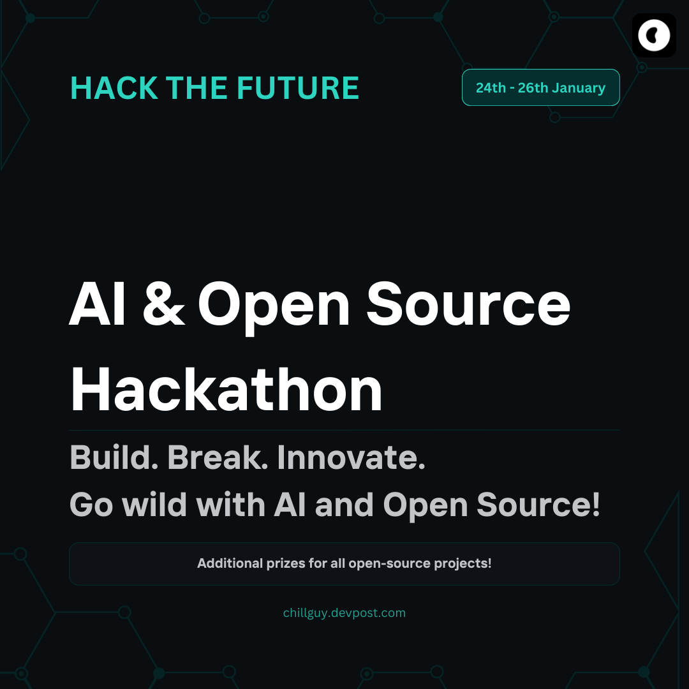

An example chatbot using [Gradio](https://gradio.app), [`huggingface_hub`](https://huggingface.co/docs/huggingface_hub/v0.22.2/en/index), and the [Hugging Face Inference API](https://huggingface.co/docs/api-inference/index).

  

*Mistral_education_bot*  

---

# Welcome to Henry Vane's Project to Hack the Future: AI & Open Source Hackathon  

---

### What it does?  

**"Deep Seek education bot"** was designed for use in adaptive learning systems.  
For more convenient and faster use, it was placed on the Hugging Face platform.  

At the moment, only two training options are offered:  
1. **"Regular reasoning with a teacher"**  
2. **"Curriculum"**  

When selected, a window appears for filling in data, on the basis of which the model will build an individual plan.  

*(In the future, the project will be improved and offer more extensive functionality. For now, we can say that this is a Demo version.)*  

---

### Useful Links  

- [Devpost Hackathon](https://chillguy.devpost.com/)  
- [Hugging Face Space](https://huggingface.co/spaces/HenryVane/DeepSeek-education-bot)  
- [My project on Devpost](https://devpost.com/software/deep-seek-educational-bot)  
